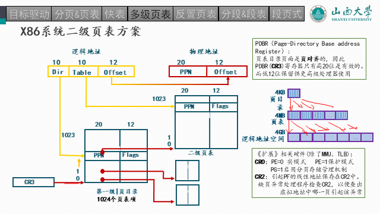
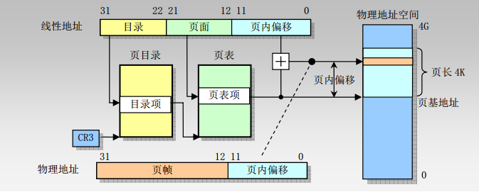

# Lab3：内存管理

[toc]

<p align="right">
  编辑设计：封裕轩 
</p>

<p align="right">
  审核校对：陈  千 
</p>

<p align="right">2023年12月10日</p>

## 实验目的

本次实验的目的是让学生掌握x86架构下的内存管理的基本概念和原理，并通过阅读xv6-public源代码和相关手册，借助gdb调试技术深入理解通用操作系统中内存管理的实现细节，掌握x86中xv6的内存布局、二级页表、内存分配和回收等重要原理。

## 实验环境

本次实验基于Lab2基于qemu-system-x86的XV6-public内核作为实验环境，大量使用Lab1的vim编辑器、gcc编译器、gdb调试器和make工具。

## 前导知识

xv6的内存管理包括内核空间管理和用户空间管理，前者不涉及到进程概念，在物理地址空间中统一放置，后者涉及具体进程，但两者均通过二级页表统一进行管理。在引导 x86 系统启动时，处理器一开始处于实模式，这时只能访问 1MB 范围内的内存。Lab2已经带大家分析了xv6 的汇编代码，将处理器从实模式切换到保护模式。xv6在启动保护模式之后，通过一段汇编入口代码（`entry.S`）跳转到 C 内核main主函数，这里开始就涉及到内存的页式管理。本次实验主要针对内核内存管理的细节，对于用户内存空间管理基本类似。接下来详细介绍xv6 在启动保护模式后的内核加载过程和对内核内存空间的管理方式的前导知识。

### 一、xv6的内核加载过程

在 xv6 启动并进入保护模式后，除了加载内核映像，内核会分配一些内存用于变量、缓冲区、堆栈和页表等结构的存储。这些内核的内存结构（一共四部分）通过二级页表机制映射到物理内存(后续会有实验任务观察这四个内存结构)。内核的加载过程主要包括如下几步：

	1. **MBR（bootblock）加载**：也就是磁盘的第0个扇区，上节课大家观察的`MBR`加载；
	1. **加载内核代码，布局内核环境的加载**：将`kernel`内核镜像文件的第一个扇区加载到一个已知的位置(`0x10000`)，并根据这个扇区的`ELF`头调整重定位(这一步实际上是`entry.S`做的）；
	1. **真正加载内核**：根据`entry.S`读取的内容，将整体的内核1MB读入到`0x100000`位置处；
	1. **加载临时一级页表**；
	1. **跳转至主函数执行内核二级页表创建**：在内核的清除和初始化工作完成后，将控制权转交给内核的 main() 函数中的 C 代码，在这里进行内核的二级页表创建。

​	xv6 使用页表将虚拟地址映射到内核内存空间中的物理地址。内核同进程一样也是使用两级页表结构进行管理，对于内核而言即内核页目录表（kernel page directory）和内核页表（kernel page table）。用户页表实际上是内核页表的派生，在内核页表的基础上，增加本身的内容。但是需要区分的是，内核的页目录页表和用户进程的页目录和页表 **地址** 完全不同，但用户进程的页目录和页表内容会有部分相同（即内核页表内容）。

​	需要注意：xv6 使用 `kalloc()` 和 `kfree()` 函数进行物理内存的分配和释放。当需要分配内存时，`kalloc()` 函数会查询空闲内存列表，选择物理页，并将这些页从空闲列表中删除。释放内存时，`kfree()` 函数会将释放的物理页添加到空闲列表中，以便下次分配时使用。

​    

### 二、xv6页表的基本原理

在xv6中，页表由软件实现，主要由以下两个部分组成：

1.内核页表：内核页表维护了内核地址空间的映射关系，它由内核代码在系统启动时建立。内核页表在系统运行时不会改变，并且被所有用户进程共享。

2.用户页表：每个用户进程都有一个独立的用户页表，用于映射该进程的虚拟地址到物理地址。在进程创建时，xv6会为该进程创建一个新的页表，并将内核页表的映射复制到该页表中。用户进程可通过修改自己的页表来管理自己的地址空间。

在xv6中，硬件负责将虚拟地址翻译为物理地址，该过程主要由以下几个模块协同完成：

1.CPU控制器：CPU控制器接收来自CPU的虚拟地址，并将其发送给页表管理单元（MMU）。

2.MMU：MMU负责控制内存中页表的访问和翻译虚拟地址。MMU包含页表基址寄存器（Page Table Base Register），用于记录当前进程的页表的地址。

3.页表：页表由内核构建，用于将虚拟地址映射到物理地址。当MMU接收到虚拟地址时，它将使用页表查找对应的物理地址。

4.物理内存：物理内存存储数据和代码，并接收由MMU翻译后的物理地址。

总之，xv6的页表实现由软件部分和硬件部分组成，软件部分负责创建和管理页表，硬件部分负责将虚拟地址映射到物理地址。

### 三、快表机制

在地址转换时一个重要机制即快表硬件，其位于MMU芯片中，通常集成到CPU中。由于快表具有很高的速度，因此在地址翻译过程中尽可能多地使用快表是很重要的。在xv6中，当快表未命中时，需要在做完地址转换后对当前页表项进行更新，若快表被填满，则需要利用某种置换机制清除快表中相关的条目并替换成目标页表项，以便在下一次访问时使用最新的页表数据。这些操作均由硬件机制实现，对操作系统的开发设计人员是透明的，因此xv6-public中xv6内核不涉及到快表的更新操作。

### 四、重要文件及函数

 `memlayout.h`：声明 XV6 内存布局的常量，以及用于将虚拟地址转换为物理地址的宏。

`entry.S`：在页目录机制创建好之前，在里面创建了第一个临时页表，用于内核C代码 的启动。同时负责跳转到`main`。很快大家就看到`main`函数使用`kvmalloc`切换创建到一个新页表中。

#### 1. bootmain.c

书接上回，`bootasm.S`进入了保护模式，开启了A20线，允许使用大于1MB的内存（实际上是32位），创建了全局内存描述符`GDT`数组，用于内存的权限控制。

据此，内核启动的环境已经准备完毕。紧接着，进入了`bootmain.c`，这段代码加载`kernel`的`ELF`到物理内存的`0x10000`处。通过读取`ELF`头，获取内核的相关加载信息，将内核的具体环境给准备好。

再通过`ELF`读出来，内核需要加载到`0x100000`处（和上面比多了一个0噢！）。

运行`entry.S`处的函数！

实际上，通过`makefile`可知，上面所提到的两个代码都被链接成一个文件那就是`bootblock`，它的大小正好是512字节，通过`file`命令可知道是`MBR`格式。上节课加载到`MBR`处的第0个扇区，就是它。 


<center> <b>以下为Makefile的截取</b> </center>

```makefile
xv6.img: bootblock kernel fs.img
	dd if=/dev/zero of=xv6.img count=10000
	dd if=bootblock of=xv6.img conv=notrunc # bootblock部分放置到第一个扇区(该部分必须保证自己的size小于512bytes)
	dd if=kernel of=xv6.img seek=1 conv=notrunc # kernel代码放置到第二个以及以后的扇区
bootblock: bootasm.S bootmain.c
	$(CC) $(CFLAGS) -fno-pic -O -nostdinc -I. -c bootmain.c
	$(CC) $(CFLAGS) -fno-pic -nostdinc -I. -c bootasm.S
	$(LD) $(LDFLAGS) -N -e start -Ttext 0x7C00 -o bootblock.o bootasm.o bootmain.o
	$(OBJDUMP) -S bootblock.o > bootblock.asm
	$(OBJCOPY) -S -O binary -j .text bootblock.o bootblock
	./sign.pl bootblock # 检查bootblock的大小，并在最后两个字节处添加标志: 0x55 0xAA，这是启动扇区的标志。
kernel: $(OBJS) entry.o entryother initcode kernel.ld
	$(LD) $(LDFLAGS) -T kernel.ld -o kernel entry.o $(OBJS) -b binary initcode entryother

```

#### 2. entry.S 汇编代码

在物理内存`0x10000c`处执行第一条代码，加载页表机制，并且把控制权交给`main`。

CR3用于保存页目录的地址，每个进程都拥有一个自己的页目录，当前只有内核在启动，所以只需要维护一个页目录即可。具体页目录的内容在`main.c`中。

就由这个页表启动了简单的内核虚拟地址映射关系。

#### 内核加载完的物理内存布局

```
读取kernel数据到内存0x10000处，读取之后内存的样子如下:
0x10000(64KB)这个地方的内容只是暂时存放kernel img(elf文件)的hdr内容的，
根据elf header的内容进一步读取kernel img的内容，实际的内容将会存在在
1MB地址处，这个1MB地址是在kernel.ld中定义的(AT(0x100000))，这恰好跟
kernel memlayout吻合起来，见memlayout.h。

                   +-------------------+  4GB                 
                   |                   |                      
                   |                   |                      
                   |                   |                      
                   |                   |                      
                   |                   |                      
                   |                   |                      
                   |                   |                      
                   |                   |                      
                   +-------------------+                      
                   |                   |                      
 (main.c)main() -> |      kernel       |                      
                   |                   |                      
  0x100000(1MB) -> +-------------------+                      
                   |                   |                      
  0x10000(64KB) -> +elf hdr of kern img+    (tmp use. elf header content)                    
                   |                   |                      
   0x7c00 + 512 -> |      \x55\xAA     |                      
                   |                   |                      
       .gdtdesc -> +-------------------+                      
                   |                   |                      
           .gdt -> +-----+-------------+ <- gdtr(GDT Register)
                   |     |  seg null   |                      
                   | GDT |  seg code   |                      
                   |     |  seg data   |                      
                   +-----+-------------+                      
                   |                   |                      
                   |                   |                      
    bootmain()  -> |                   |                      
                   |        code       |                      
                   |                   |                      
      .start32  -> |                   |                      
                   |                   |                      
(0x7c00).start  -> +---------+---------+ <- esp               
                   |         |         |                      
                   |         v         |                      
                   |       stack       |                      
                   |                   |                      
                   |                   |                      
                   +-------------------+  0GB                 
```

#### 3. main.c — kvmalloc()函数


`kinit1`函数主要做的就是第一个页的内存初始化，仅供了解。

`kvmalloc()`真正实现内核的二级页表结构。

在这个函数有两步操作：


下面会详细解释这两个函数。

#### 4. setupkvm函数

这是一个全局变量数组，用于内核的初始化，一共有四个元素：虚拟内存地址，物理内存起始地址，物理内存结束地址以及访问权限。详细阅读其注释，看看这四个区域各有什么用处。一会我们会按照这个模版来创建真正的内核页表。


<center>页表构成，暂存数据结构</center>


<center>页目录创建</center>

<center>(包括页目录指针和4KB页目录)</center>


#### 5. switchkvm函数

将cr3内容改为页目录地址。

至此，内核页表就创建完毕了，其实内核页表非常简单，用户的页表也类似。


### 参考资料

* gdb调试
	1. gdb图形化调试界面：`layout src` 
	2. 跳出当前函数: `finish`
	3. 查看断点：`info break`
	4. 禁用断点：`disable 上面查看的断点号（比如1）`
	5. 继续执行到下一个断点：`continue`
	6. 打印二进制数值： `print /t 变量名`
	7. 单步执行c语句: `step`
	8. 单步执行但不进入函数：`next`
	9. [其余未列举的参考本文档](https://csapp.cs.cmu.edu/3e/docs/gdbnotes-x86-64.pdf)

* [xv6中文文档](https://th0ar.gitbooks.io/xv6-chinese/content/index.html)
* [xv6官方原文文档](https://pdos.csail.mit.edu/6.828/2012/xv6/book-rev7.pdf)

* 部分宏定义`mmu.h`

`memlayout.h`


## 实验内容

### Ex3-1: 页表的创建过程

**任务要求：**


1. 结合下图页表结构和宏定义，**详解**`mappages`函数内是如何创建二级结构的，需要结合代码，指出a和last变量分别是什么。

2. 以其中第一个映射关系的第一个页表的创建，`gdb`调试，需要打印各个重要的变量（`mappages`中的`a`，`last`，`walkpagedir`中的`pde`，`pgtab`以及其内容`*pde`和`*pgtab`，截图和说明作用。介绍这个例子是如何创建页表的，在当前页创建完毕之后，`a`和`pa`变量如何控制剩余页的循环创建？

	> 将断点打到`mappages`，截图当前的入口参数，看看页表是如何创建的，是否和你上面的理解一样。
	>
	> 
	>
	> 虚拟地址是0x80000000，大小为1048576=0x100000
	>
	> 打印二进制变量： `print /t 变量名`
	>
	> 另外，需要走进（step）`walkpgdir`，观察页表是如何创建的。
	>
	> 返回后的页表指针，是如何填充内容的。

2. 查看在`kalloc.c`文件中的`kalloc`，简述是如何分配一个页的？

3. 按照刚才调试的一个页表的创建，画出内核的二级页表结构。（目前只有一个页表）

**建议：先gdb拿到mappages的参数，动手计算页目录索引和页索引以及偏移量，再去验证会更易懂。**


**关键步骤： CR3寄存器，页目录地址，页表的创建，页表项的添加。**

```
 A virtual address 'la' has a three-part structure as follows:

 +--------10------+-------10-------+---------12----------+
 | Page Directory |   Page Table   | Offset within Page  |
 |      Index     |      Index     |                     |
 +----------------+----------------+---------------------+
  \--- PDX(va) --/ \--- PTX(va) --/
```


> 这样两个页表结构的作用：
> 在操作系统内核启动的早期阶段，需要建立一个最小的页表结构来启动和配置虚拟内存系统。一级页表是用于建立这个最基本的映射，它是一个简化的页表结构，允许内核在启动阶段进行基本的地址映射。
>
> 一级页表的建立主要目的是为了启动内核的基本运行环境，它可能不包含完整的映射信息，只包含启动所需的最小信息。这样做有助于内核启动过程中使用最少的资源来建立必要的基本内存管理结构，使得在进一步初始化内存管理之前能够正常运行。
>
> 在进入到 `main.c` 中创建二级页表之后，内核会逐步完善页表结构，包括添加更多的映射信息，以支持更复杂的虚拟内存管理功能。因此，一级页表主要是为了启动阶段的基本内存管理需求而创建的，而后续的二级页表则是为了更全面、更灵活地管理虚拟内存。
>
> 所以，我们可以看见，第一个一级页表只有两个内容，而第二个二级页表有四个内容。





### Ex3-2: 理解xv6中的内存布局

在`kvmalloc`函数之后，内核的虚拟内存映射，二级页表机制已经建立完毕。

**任务要求：**

1. 在`qemu`中打印`kvmalloc`函数结束后的系统虚拟内存分布，并 **截图**。
2. 结合刚才内核二级页表的创建（关注点在初始的那个页表结构体数组），**解释**为什么是这样的？

提示：在`xv6`的启动界面，（就是执行过 `make qemu-gdb`那个界面，按`ctrl + A + C`），输入`info mem`，查看当前的内存分布。

### Ex3-3: 内存分配

观察用户进程如何在分配页表：

* `growproc`函数传入一个n表示要将当前进程的内存空间增长到n字节，或者释放到n字节，取决于传入的n是比当前程序所占的内存空间是大于n还是小于n。增长调用`allocuvm`，释放调用`deallocuvm`。

* `allocuvm`函数传入当前进程的页目录，当前大小，将要扩充后的大小。

**任务要求**：

1. 将断点打到`growproc` ，`allocuvm`，`kalloc`；
2. 在`growproc`函数，观察传入`allocuvm`的参数是多少，各自是什么含义，截图说明；

> 

3. 简单看一下`allocuvm`是如何分配新的页面的，简述过程；

	


如果想下载我的带注释版本：`git clone https://github.com/ohhoo0/my-xv6-public.git`


